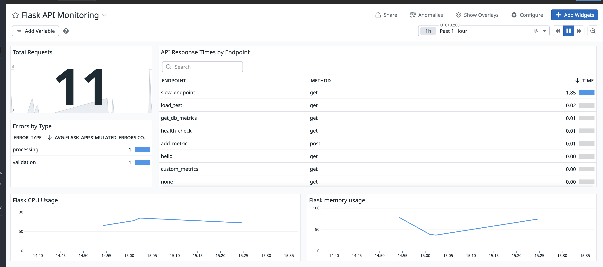

# Datadog Sandbox 🐕

A simple local environment for learning Datadog monitoring with Docker Compose.



## Quick Start

1. **Setup environment**:
   ```bash
   cp env.example .env
   # Edit .env and add your Datadog API key
   ```

2. **Run the setup script**:
   ```bash
   chmod +x scripts/setup.sh
   ./scripts/setup.sh
   ```

3. **Test the endpoints**:
   - Health Check: http://localhost/api/health
   - System Metrics: http://localhost/api/system-metrics
   - Slow Response: http://localhost/api/slow
   - Error Simulation: http://localhost/api/error
   - Load Test: http://localhost/api/load

## What's Included

- **Flask API** with monitoring endpoints
- **PostgreSQL** database
- **Nginx** reverse proxy
- **Datadog Agent** for monitoring
- **Redis** for caching

## API Endpoints

- `GET /api/health` - Health check with database status
- `GET /api/system-metrics` - CPU, memory, and disk metrics (for Docker Desktop)
- `GET /api/slow` - Simulates slow responses (1-3 seconds)
- `GET /api/error` - Generates random errors for testing
- `GET /api/load?operations=N` - CPU load testing

## Docker Desktop Users

For Docker Desktop environments, use the `/api/system-metrics` endpoint to generate CPU and memory metrics:

```bash
# Generate system metrics
curl http://localhost/api/system-metrics

# Generate CPU load and check metrics
curl "http://localhost/api/load?operations=50000"
curl http://localhost/api/system-metrics
```

Look for these metrics in Datadog:
- `flask_app.system.cpu_percent`
- `flask_app.system.memory_percent`

## Useful Commands

```bash
# View logs
docker-compose logs -f

# Check Datadog agent status
docker-compose exec datadog-agent agent status

# Stop everything
docker-compose down
```

Happy monitoring! 📈