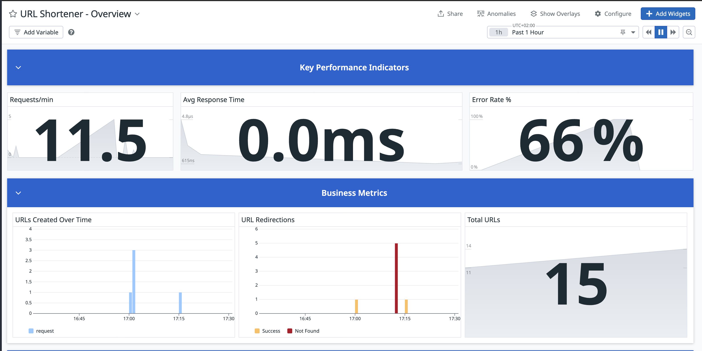
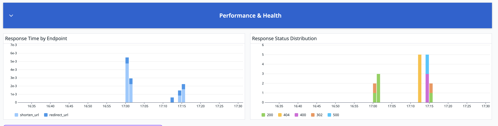

# 🔗 URL Shortener with DataDog Monitoring

A simple, production-ready URL shortener service built with Flask and comprehensive DataDog monitoring integration.


## 📊 Dashboard

The URL shortener comes with comprehensive DataDog monitoring dashboards that provide real-time insights into your application's performance and business metrics.

### Production Overview Dashboard



**Key Metrics Tracked:**
- Request rates and response times
- URL creation and access patterns
- Error rates and HTTP status distributions
- Business KPIs and performance indicators

📖 **Setup Guide:** Follow the detailed [Dashboard Setup Guide](./DASHBOARD_GUIDE.md) to create these dashboards in your DataDog account.


## ✨ Features

- **URL Shortening**: Convert long URLs into short, shareable links
- **Web Interface**: Simple HTML form for easy URL shortening
- **REST API**: JSON API for programmatic access
- **Persistent Storage**: File-based storage that survives container restarts
- **Comprehensive Monitoring**: DataDog integration with business and performance metrics
- **Production Ready**: Docker containerized with proper logging

## 🚀 Quick Start

### Prerequisites
- Docker & Docker Compose
- DataDog account and API key

### Setup

1. **Clone and navigate to the project:**
   ```bash
   cd url-shortener
   ```

2. **Configure DataDog:**
   ```bash
   cp env.example .env
   # Edit .env and add your DataDog API key
   ```

3. **Start the application:**
   ```bash
   docker-compose up --build
   ```

4. **Access the service:**
   - Web Interface: http://localhost:8080
   - API Endpoint: http://localhost:8080/shorten
   - Stats: http://localhost:8080/stats

## 📖 Usage

### Web Interface
1. Open http://localhost:8080 in your browser
2. Enter a URL in the form
3. Click "Shorten" to get your short URL
4. Use the short URL to redirect to the original

### REST API

#### Create Short URL
```bash
curl -X POST http://localhost:8080/shorten \
  -H "Content-Type: application/json" \
  -d '{"url": "https://www.example.com"}'
```

**Response:**
```json
{
  "original_url": "https://www.example.com",
  "short_url": "http://localhost:8080/abc123",
  "short_code": "abc123"
}
```

#### Access Short URL
```bash
curl -L http://localhost:8080/abc123
# Redirects to the original URL
```

#### Get Statistics
```bash
curl http://localhost:8080/stats
```

**Response:**
```json
{
  "total_urls": 5,
  "urls": {
    "abc123": "https://www.example.com",
    "def456": "https://www.google.com"
  }
}
```

## 📊 Monitoring & Observability

This application includes comprehensive DataDog monitoring out of the box:

### Business Metrics
- **URLs Created**: Track URL shortening activity
- **URL Accesses**: Monitor redirect usage and success rates
- **Total URLs**: Current scale and growth
- **Error Tracking**: Validation errors, 404s, application errors

### Performance Metrics
- **Response Times**: Performance by endpoint
- **Request Rates**: Traffic patterns and volume
- **HTTP Status Codes**: Overall service health
- **Error Rates**: Reliability monitoring

### Dashboard Setup
Follow the [DASHBOARD_GUIDE.md](./DASHBOARD_GUIDE.md) to create production-ready monitoring dashboards in DataDog.

## 🏗️ Architecture

```
┌─────────────────┐    ┌──────────────────┐    ┌─────────────────┐
│   Web Browser   │    │   REST Client    │    │  DataDog Agent  │
│                 │    │                  │    │                 │
└─────────┬───────┘    └─────────┬────────┘    └─────────┬───────┘
          │                      │                       │
          │ HTTP                 │ HTTP                  │ StatsD
          │                      │                       │
          ▼                      ▼                       ▼
    ┌─────────────────────────────────────────────────────────────┐
    │                    Flask Application                        │
    │  ┌─────────────┐  ┌─────────────┐  ┌─────────────────────┐ │
    │  │     Web     │  │     API     │  │      Monitoring     │ │
    │  │  Interface  │  │  Endpoints  │  │     Middleware      │ │
    │  └─────────────┘  └─────────────┘  └─────────────────────┘ │
    └─────────────────────┬───────────────────────────────────────┘
                          │
                          ▼
                ┌─────────────────┐
                │   File Storage  │
                │   (urls.json)   │
                └─────────────────┘
```

### Project Structure
```
url-shortener/
├── app.py                 # Main Flask application
├── docker-compose.yml     # Docker services configuration
├── Dockerfile            # Application container
├── requirements.txt      # Python dependencies
├── env.example          # Environment variables template
├── data/               # Persistent storage directory
│   └── urls.json      # URL mappings storage
├── README.md          # This file
└── DASHBOARD_GUIDE.md # DataDog dashboard setup guide
```

## 📈 Metrics Reference

### Automatic Metrics (via Middleware)
- `url_shortener.requests.count` - Request count by endpoint/method
- `url_shortener.responses.count` - Response count by endpoint/method/status
- `url_shortener.response_time` - Response time distribution

### Business Metrics (via Application Logic)
- `url_shortener.urls.created` - URLs shortened (tagged by request_type)
- `url_shortener.urls.accessed` - URL redirections (tagged by status)
- `url_shortener.urls.total` - Total URLs stored (gauge)
- `url_shortener.errors` - Errors by type (validation, not_found, application)
- `url_shortener.stats.accessed` - Stats endpoint usage

### Available Tags
- `endpoint`: `home`, `shorten`, `redirect_url`, `stats`
- `method`: `GET`, `POST`
- `status`: HTTP status codes (200, 302, 404, 500)
- `request_type`: `api`, `web`
- `error_type`: `validation`, `not_found`, `application`

## 🔧 Configuration

### Environment Variables
```bash
# DataDog Configuration
DD_API_KEY=your_datadog_api_key_here
DD_SITE=datadoghq.com  # or datadoghq.eu for EU
DD_ENV=development     # environment name
DD_VERSION=1.0.0      # application version

# Application Configuration
FLASK_ENV=production
```

## 📝 API Reference

| Endpoint | Method | Description | Request | Response |
|----------|--------|-------------|---------|----------|
| `/` | GET | Web interface | - | HTML form |
| `/shorten` | POST | Create short URL | JSON/Form data | Short URL details |
| `/<code>` | GET | Redirect to original | - | HTTP 302 redirect |
| `/stats` | GET | Get statistics | - | URL count and mappings |